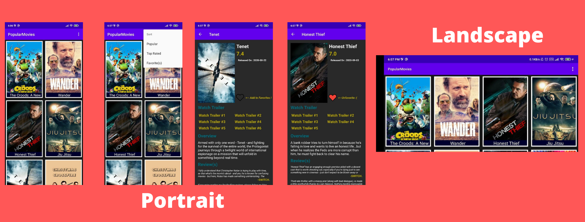

# Movie Information App

## What does this app do ?

This app shows movies fetched from moviedb.org website.

## Features

- App is in JAVA
- App architecture: MVVM
- App stores the fetched data in Database after converting it to relevant Object
- User can sort movies based on Popular and Latest tags
- User can favorite the movie(s) and it will be stored in database.
- User can watch trailers of the movie (redirects to youtube).

# App demo

# Screenshots

